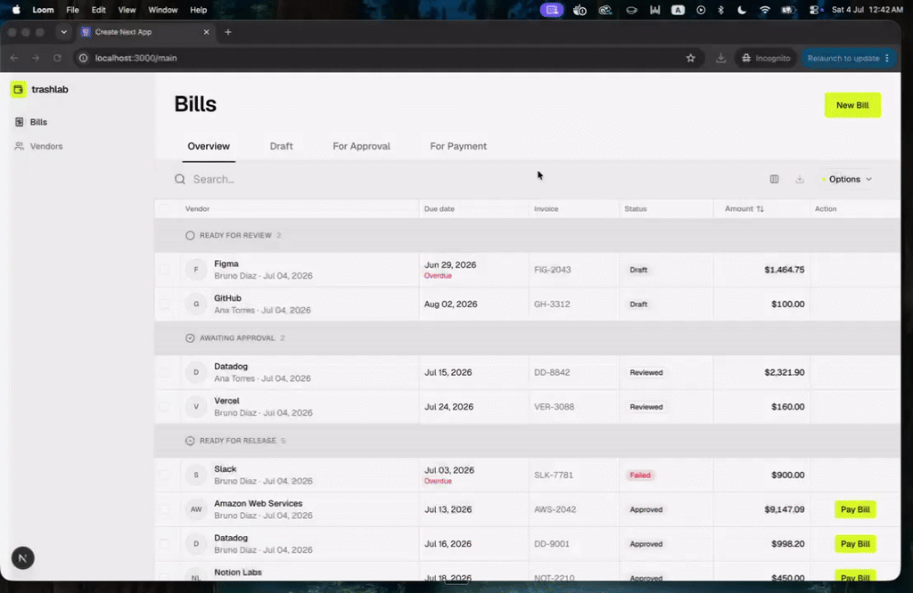
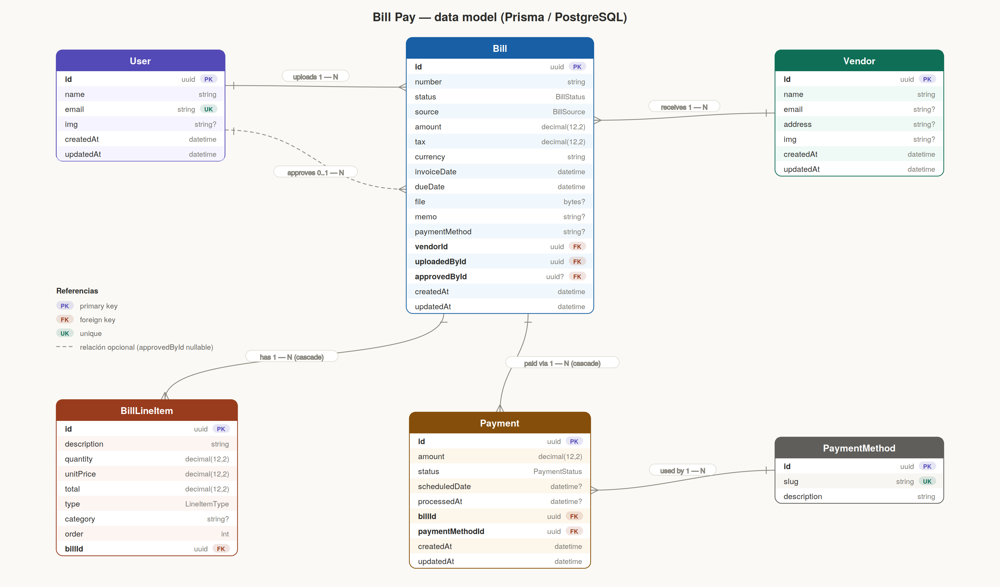

# TrashLab Challenge

An **accounts-payable / Bill Pay** product take-home, with **Ramp** as the
visual reference. A company receives bills from vendors and moves each one
**draft → review → approve → pay**; the bill's **status drives the whole UI**.

## Demo

<!-- GitHub strips <iframe>, so the demo is a clickable thumbnail (animated GIF preview,
     self-hosted in docs/ so it always renders) that opens the Loom. To embed a *playable*
     inline video instead, upload an .mp4 to GitHub (drag it into the README editor on
     github.com) and use the resulting user-attachments URL. -->
<a href="https://www.loom.com/share/c0d7171a434646f4afff71f27e877cc3" target="_blank" rel="noopener noreferrer"></a>

- **WEB:** https://trashlab-th-qw7zvtdol-eduleccas-projects.vercel.app/main
- **STORYBOOK:** https://trashlab-th-ui-system-2zujlr31c-eduleccas-projects.vercel.app/?path=/story/components-textarea--default

## Approach

The approach was to build this **end-to-end**: a single framework that lets me interact
with a backend easily, without standing up a separate Node or Python environment. That's
why I chose **Next.js** — fast backend interaction.

I needed that backend to do real work around the AI on the server — not just to call
**Claude** (a model with OCR) for the bill scanner, but, for example, to **manipulate and
validate the PDF before** sending it, keep the API key server-side, and return **custom
responses** when there's an error.

Also, I know Next's backend has limits — route handlers are serverless functions that time
out (~10s Hobby / 60s Pro on Vercel), so a slow AI call can hit that. If this went to prod,
a dedicated backend would be worth a look.

The challenge asked for the product to **look and feel a lot like Ramp**, using Ramp's own
product as the visual reference — I worked from
[Ramp's Bill Pay docs](https://support.ramp.com/managing-bills-and-payments-on-bill-pay/) and the
[Ramp product tour](https://ramp.com/explore-product). So I split the design system into a
**separate package** —
**`ui-system`** (a design module several apps could share) — with **atomic components**,
which lets me consume them directly without much manipulation. It has a **Storybook** inside.

## What's inside

- **Backend** — part of the API, lives in Next (route handlers + server actions).
- **Frontend** — all the frontend.
- **AI** — Claude, via an API key.
- **UI System** — the shared component library (`packages/ui-system`, with Storybook).
  Built on **shadcn** (Tailwind + CSS-variable design tokens; you own the component code),
  which fits reproducing Ramp's tokens.

```
apps/web            → the product (Next.js: frontend + API)
packages/ui-system  → the design system (components + Storybook)
```

## Stack

- **Next.js 16** (App Router) · **React 19** · **TypeScript**
- **Tailwind v4** + **shadcn** (CSS-variable design tokens)
- **Zustand** (client state) · **TanStack Query** (server cache)
- **Prisma 7** + **Neon** (Postgres)
- **Vercel AI SDK** (`ai` + `@ai-sdk/anthropic`) → **Claude**; **pdf-lib** for PDF validation
- **Storybook 10** (design-system docs) · **Vitest** (unit / store / a DB integration test)

## Architecture

**State (Zustand)** — two in-memory stores:

- **`main`** — the table's display state: search filter, column visibility + order, and the
  row selection that drives bulk actions.
- **`new bill`** — the draft being created/edited: form fields, line items, uploaded PDF, and
  extraction status.

**TanStack Query** — server cache + loading state for the bill lists; mutations invalidate and
refetch.

**UI System** — components kept **as stateless as possible** so they compose freely across the app.

**AI — two agents** (orchestrated by `/api/extract`, via the Vercel AI SDK):

- a **classifier** — cheap model (`claude-haiku-4-5`) that decides whether the upload is a bill,
  so junk exits early without spending the expensive call;
- an **extractor** — strong model (`claude-opus-4-8`) that pulls the structured fields.

Pattern: **cheap model filters, expensive model works.**

**Database** — deliberately lean relations (**User, Vendor, Bill, Line Items, Payment, Payment
Method**): I focused on the **billing flow**, so the schema stays simple for the MVP. Persisted
on **Neon** (Postgres) via **Prisma**.

## Data model



## The flow

The flow relies heavily on managing the **Bill's status** — a bill moves from state to
state:

```
DRAFT → REVIEWED → APPROVED → PAID
```

- **Upload** a bill → if it's valid, it's detected and pre-loaded as a **draft**.
- **Review / confirm** it → **reviewed**.
- **Approve** it → **approved**.
- **Pay** it → **paid**.

On upload, two kinds of errors can surface:

1. the document isn't considered a **valid bill**;
2. it's detected as a **duplicate bill** — surfaced with a badge/banner.

## Out of scope (deliberate)

- **Mobile** — left out on purpose. Handling this much data-dense visualization is genuinely
  complex on mobile (it's typically a desktop/web experience), so I focused on the web view.
  It still renders on mobile, but the flows would need rethinking for a real mobile version.
- **Bulk ingestion** — no multi-PDF or Excel/CSV upload. It's an MVP and I wanted to show
  the core flow — **upload → ingest → recognize** — so bulk was set aside.
- **Email ingestion** — no AP email forwarding (Ramp's `@ap.ramp.com` inbox that turns vendor
  emails into drafts). Manual upload already covers the same **ingest → recognize** path.
- **Advanced table filters** — beyond the status tabs, search, column controls, sorting, and
  CSV **export** that do ship, I didn't build richer filters (by vendor / date range). With the
  view store already in place, they'd slot in the same way.
- **Payment flows** — the concrete payment logic is left out. I wanted to show a normal
  bill-advancement flow (draft → … → paid); the real payment flows and their business rules
  would go deeper than the MVP needs.
- **Auth** — no authentication. To keep it MVP there's just a **single user**; the server
  actions attribute everything to that one user. No login, roles, or multi-tenant.
- **File storage** — PDFs aren't uploaded to external object storage (e.g. **S3**); they're
  stored in the DB as **blobs** (`Bytes` / BYTEA). Fine for the MVP, wouldn't scale.
- **Observability** — no monitoring / APM (e.g. **Datadog** / **New Relic**) and no error
  tracking (e.g. **Sentry**). You'd wire these up for production.

## How it was built

Built with **Claude Code**, using **spec-driven development via
[OpenSpec](https://github.com/Fission-AI/OpenSpec)** for the hard parts — each change written as
intent + specs + tasks keeps context across sessions (see `openspec/`).

## Run locally

```bash
# apps/web/.env  — add this file BEFORE installing (postinstall runs `prisma generate`)
#   DATABASE_URL=<your Neon Postgres URL>
#   ANTHROPIC_API_KEY=<your Claude API key>

npm install

npm run db:migrate -w web   # apply migrations
npm run db:seed -w web      # demo data
npm run dev                 # web app  (apps/web)
npm run storybook           # design system (packages/ui-system)
npm run test -w web         # tests (Vitest) — co-located in _tests/ folders
```
